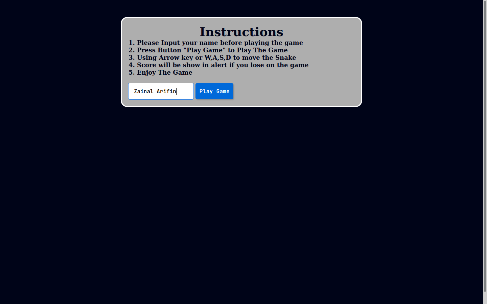
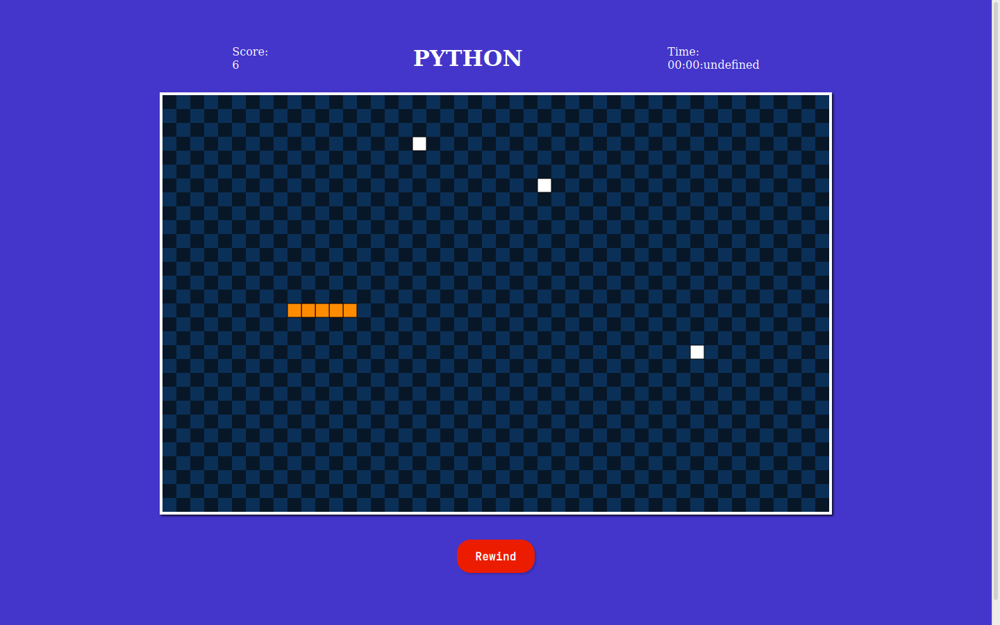

<!-- @format -->

# Python-Snake-Game (skill competition) - Client Side Module

### Introduce

**Python-Snake-Game** is the common name for a video game concept where the player maneuvers a line which grows in length, with the line itself being a primary obstacle. The concept originated in the 1976 arcade game Blockade, and the ease of implementing Snake has led to hundreds of versions for many platforms.[Wikipedia](https://www.wikipedia.org/)




### Installation

```sh
$ git clone https://github.com/Zainal21/Python-Snake-Game/
$ cd Python-Snake-Game
$ double click or open index.html ifor running this project
```

---

## Note

> **There are some unfinished features, such as Rewind, timer, etc**

### The Project is MIT licensed.

Built with [javascript](https://www.javascript.com/). Develop by [Muhamad Zainal Arifin](muhammadzaindev.vercel.app/)

---

2020 © Muhamad Zainal Arifin
